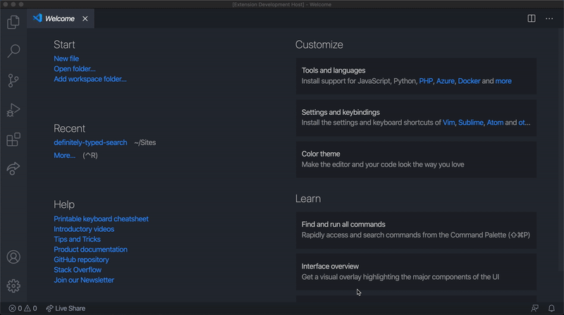

# Definitely Typed Search

Opens up the Definitely Typed Search page from within VS Code.

## Features

To make use of this extension, hold `cmd + Shift + P` to toggle the command palette. Then start typing 'Definitely Typed Search', hit enter when it appears. 

Below is an example:

## Release Notes

### 0.1.0

Initial release.
